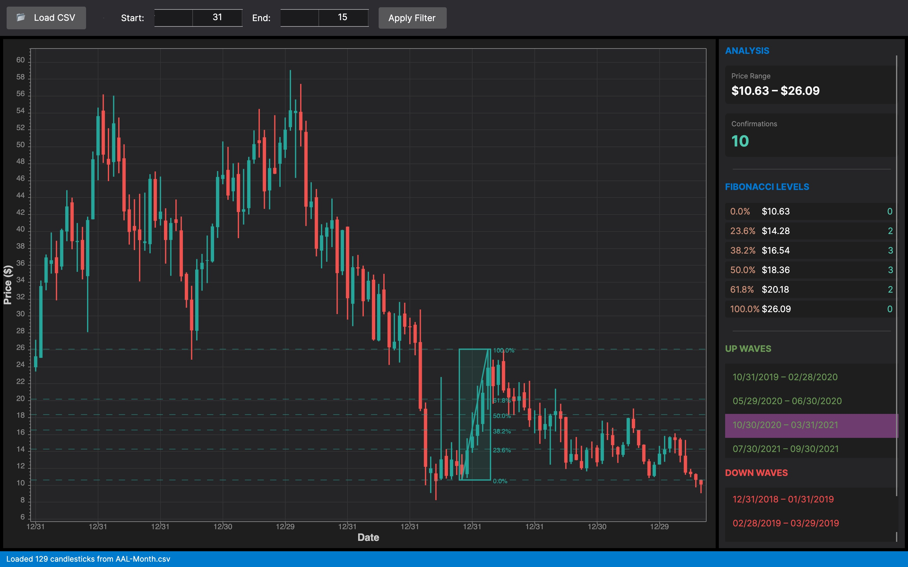

# Stock Analyzer

A technical stock analysis application featuring candlestick charts, peak/valley detection, wave analysis, and Fibonacci retracement levels.



## Features

- **CSV Data Import**: Load stock data from CSV files in OHLCV format
- **Candlestick Charts**: Beautiful candlestick visualization with customizable date ranges
- **Peak & Valley Detection**: Automatic detection of local price extremes
- **Wave Analysis**: Identifies upward and downward price waves between detected extremes
- **Fibonacci Retracement**: Displays key Fibonacci levels (0%, 23.6%, 38.2%, 50%, 61.8%, 100%)
- **Interactive Selection**: Click and drag to manually define wave regions

## Two Versions

This repository contains **two versions** of the application:

### 1. Windows Forms (Original)
Located in the root directory. Requires Windows and .NET Framework 4.7.2.

### 2. Avalonia (Cross-Platform) ⭐
Located in `StockAnalyzer.Avalonia/`. Runs on **macOS, Windows, and Linux**.

| Feature | WinForms | Avalonia |
|---------|----------|----------|
| Platform | Windows only | macOS, Windows, Linux |
| Framework | .NET Framework 4.7.2 | .NET 8.0 |
| Charting | System.Windows.Forms.DataVisualization | ScottPlot 5 |
| Architecture | Forms-based | MVVM |

---

## Quick Start (Avalonia - Cross-Platform)

```bash
cd StockAnalyzer.Avalonia
dotnet run
```

## Quick Start (Windows Forms)

1. Open `StockAnalyzer.sln` in Visual Studio
2. Build and run (F5)

---

## CSV Format

```csv
Date,Open,High,Low,Close,Volume
2024-01-02,185.53,186.88,183.62,185.24,28987123
```

## Usage

1. Click **Load CSV** to select a stock data file
2. Adjust date range and click **Apply Filter**
3. Select a wave from the **Up Waves** or **Down Waves** list
4. View **Fibonacci levels** and price **confirmations**

## Sample Data

A sample CSV file is included at `sample-data/SAMPLE-Day.csv`.

---

## Technical Overview

### Core Logic (UI-Independent)
| File | Description |
|------|-------------|
| `Candlestick.cs` | OHLCV data model |
| `StockReader.cs` | CSV file parser |
| `PeakValley.cs` | Peak/valley detection algorithm |
| `Wave.cs` | Wave model (valley→peak or peak→valley) |

### Avalonia App Architecture
```
StockAnalyzer.Avalonia/
├── Core/Models/       # Pure C# data models
├── Core/Services/     # StockAnalysisService (testable)
├── ViewModels/        # MVVM ViewModels
└── Views/             # Avalonia XAML UI
```

---

## License

MIT License - See [LICENSE](LICENSE) for details.
